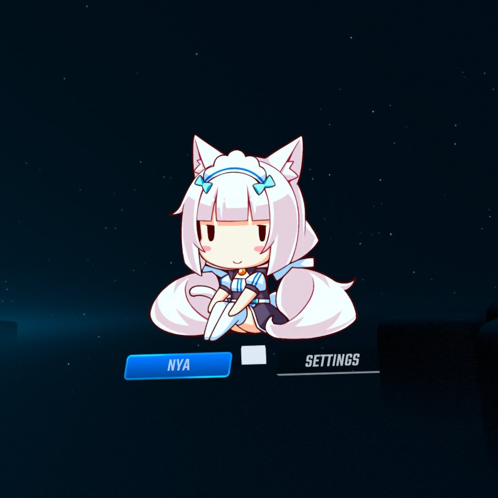

# Nya Quest  
Beat Saber Quest mod for displaying nya-tastic images from various anime themed web APIs

*It was not tested with Quest 1 if you have it, tell me if it works*

*It may crash other mods based on BSML, if you find the mod it crashes, send me the mod*

## Usage
Nya's settings can be accessed from either the Mod Settings panel or from within Nya's setting modal

### Resetting Nya's Floating Screen Position
Nya features a floating screen, allowing Nya to be accessed outside of the gameplay setup panel. In the event that this floating screen gets stuck somewhere inaccessible it's position can be reset from mod settings panel. The position can also be reset from Nya's settings modal. 
### Supported Image Sources
**Note: I don't own any of these sources so I can't guarantee the images will always be appropriate**
* [Waifu.Pics](https://waifu.pics/)
* [Nekos.Life](https://nekos.life/)
* [Anime-Images API](https://anime-api.hisoka17.repl.co/)
* [Catboys](https://catboys.com/)
* [Animals (some-random-api.ml)](https://some-random-api.ml/)
* [Local Files](#local-files)
### Local Files
In order for local files to work there must be compatible images in the sfw / nsfw files found in Nya's folder in `ModData\com.beatgames.beatsaber\Mods\Nya\Images`.
The compatible file types are PNG, JPEG, GIF.
Images which are downloaded via Nya will also be placed in the sfw / nsfw folders.
## Installation
[Install](https://bsmg.wiki/quest-modding.html#installation) the latest version of [Nya Quest](https://github.com/FrozenAlex/Nya-quest/releases/latest).
## Contribution
Feel free to point out any suggestions or improvements by submitting a PR or contacting me on Discord ([FrozenAlex#4028](https://discordapp.com/users/150649616772235264)).

## Credits

* [Sirspam](https://github.com/Sirspam) - the creator of the original [Nya](https://github.com/Sirspam/Nya) 
* [RedBrumbler](https://github.com/RedBrumbler) - for making a lot of tools I use, including a better gif implementation
* [Futuremappermydud](https://github.com/Futuremappermydud) - for the original code of the port
* [zoller27osu](https://github.com/zoller27osu), [Sc2ad](https://github.com/Sc2ad) and [jakibaki](https://github.com/jakibaki) - [beatsaber-hook](https://github.com/sc2ad/beatsaber-hook)
* [raftario](https://github.com/raftario)
* [Lauriethefish](https://github.com/Lauriethefish), [danrouse](https://github.com/danrouse) and [Bobby Shmurner](https://github.com/BobbyShmurner) for [this template](https://github.com/Lauriethefish/quest-mod-template)


## Build instructions

### Prerequisites
1. Install ninja, cmake and android ndk (version 24 or higher)
2. Create a file called `ndkpath.txt` in the project root and paste the path to ndk folder
3. install [qpm-rust](https://github.com/Lauriethefish/quest-mod-template) and add it to PATH
4. Install dependencies using `qpm-rust restore`
5. Generate a mod.json using a command `qpm-rust qmod build` (it is needed to build a mod)

### Building 
```ps1
build.ps1
```

This script has multiple options:
- -Debug - copy the development version of the mod to quest
- -Clean - removes all the build cache

### Development build and copy to quest
```ps1
./copy.ps1 -Log -Debug 
```
Before doing this command you need to install qmod version on the quest first.

This script has multiple options:
- `-Log` - starts to log after running the command
- `-Debug` - copy the development version of the mod to quest
- `-Clean` - removes all the build cache

### Make a qmod file for installing on quest
```ps1
./buildQMOD.ps1 Nya
```

## Debug recommendations

### Oculus developer tool
It's an extension for VSCode that helps with debugging. It's kinda whack but it works (Only on Windows)
[VS Marketplace Link](https://github.com/Lauriethefish/quest-mod-template)


